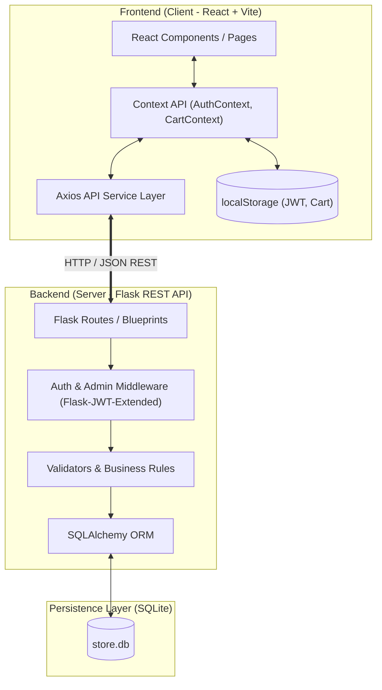
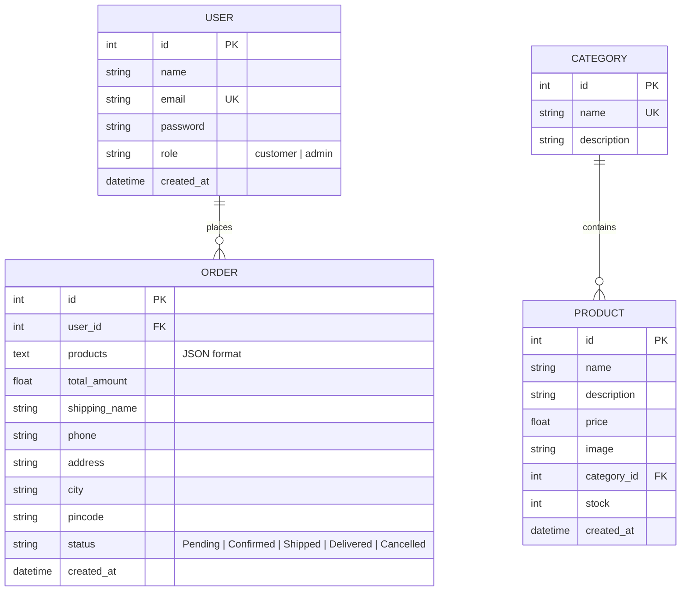

# Architecture and Database Design

## 1. System Architecture Overview

The **Electronic Appliances Store** is designed using a clean, decoupled, client-server monolithic architecture. The frontend is a Single Page Application (SPA) built with React and Vite, while the backend is a lightweight REST API built with Flask and SQLAlchemy ORM, backed by an embedded SQLite database.



---

## 2. Layered Architecture Breakdown

### 2.1 Presentation Layer (React + Vite)
- **Vite Development Server**: Serves fast HMR and bundles modular ES6 code.
- **React Router**: Controls declarative client-side route navigation and guards protected routes (`/admin/*`, `/checkout`, `/my-orders`).
- **Context API**:
  - `AuthContext`: Holds current user profile, JWT token, and handles login/logout state sync.
  - `CartContext`: Manages cart items in memory and synchronizes with browser `localStorage`.
- **Axios HTTP Client**:
  - Automatically attaches `Authorization: Bearer <token>` to protected requests.
  - Centralizes base URL configuration (`http://localhost:5000/api`).

### 2.2 API & Business Logic Layer (Flask)
- **Application Factory Pattern (`app.py`)**: Configures CORS, initializes extensions (`db`, `jwt`, `bcrypt`), and registers modular blueprints.
- **Route Blueprints**:
  - `auth_routes.py`: Handles customer/admin registration and token generation.
  - `category_routes.py`: CRUD operations for product categories.
  - `product_routes.py`: Catalog query with search/filter, and admin modifications.
  - `order_routes.py`: Order placement, stock deduction, and status transitions.
- **Middleware (`middleware/auth.py`)**:
  - `@jwt_required()`: Verifies token signature and expiration.
  - `@admin_required`: Ensures decoded token identity possesses `role == "admin"`.
- **Business Validator (`utils/validators.py`)**: Validates email regex, password minimum lengths, stock thresholds, and required checkout fields.

### 2.3 Persistence Layer (SQLite + SQLAlchemy)
- File-based SQLite database stored at `server/store.db`.
- SQLAlchemy ORM maps Python model classes directly to SQLite tables.
- All transactional writes (such as order placement + stock deduction) run inside atomic session blocks.

---

## 3. Database Schema & Data Models

The database contains strictly four models as specified:



---

## 4. Model Details

### 4.1 `User` Model
Represents both customers and store administrators.

```python
class User(db.Model):
    __tablename__ = 'users'

    id = db.Column(db.Integer, primary_key=True)
    name = db.Column(db.String(100), nullable=False)
    email = db.Column(db.String(120), unique=True, nullable=False, index=True)
    password = db.Column(db.String(255), nullable=False)  # Bcrypt hash
    role = db.Column(db.String(20), nullable=False, default='customer')  # 'customer' or 'admin'
    created_at = db.Column(db.DateTime, default=datetime.utcnow)

    # Relationships
    orders = db.relationship('Order', backref='user', lazy=True)
```

### 4.2 `Category` Model
Groups appliances into logical departments (e.g., Refrigerators, Washing Machines).

```python
class Category(db.Model):
    __tablename__ = 'categories'

    id = db.Column(db.Integer, primary_key=True)
    name = db.Column(db.String(100), unique=True, nullable=False)
    description = db.Column(db.String(255), nullable=True)

    # Relationships
    products = db.relationship('Product', backref='category', lazy=True, cascade='all, delete-orphan')
```

### 4.3 `Product` Model
Represents an individual appliance available for purchase.

```python
class Product(db.Model):
    __tablename__ = 'products'

    id = db.Column(db.Integer, primary_key=True)
    name = db.Column(db.String(150), nullable=False)
    description = db.Column(db.Text, nullable=False)
    price = db.Column(db.Float, nullable=False)  # Authoritative price in INR
    image = db.Column(db.String(500), nullable=False)  # Direct HTTPS image URL
    category_id = db.Column(db.Integer, db.ForeignKey('categories.id'), nullable=False)
    stock = db.Column(db.Integer, nullable=False, default=0)
    created_at = db.Column(db.DateTime, default=datetime.utcnow)
```

### 4.4 `Order` Model
Represents a finalized customer purchase order.

```python
class Order(db.Model):
    __tablename__ = 'orders'

    id = db.Column(db.Integer, primary_key=True)
    user_id = db.Column(db.Integer, db.ForeignKey('users.id'), nullable=False)
    products = db.Column(db.Text, nullable=False)  # Serialized JSON snapshot of ordered products
    total_amount = db.Column(db.Float, nullable=False)  # Computed on server
    shipping_name = db.Column(db.String(100), nullable=False)
    phone = db.Column(db.String(20), nullable=False)
    address = db.Column(db.String(255), nullable=False)
    city = db.Column(db.String(100), nullable=False)
    pincode = db.Column(db.String(20), nullable=False)
    status = db.Column(db.String(30), nullable=False, default='Pending')
    created_at = db.Column(db.DateTime, default=datetime.utcnow)
```

---

## 5. Serialized Order Products JSON Specification

To keep the database design simple and avoid extraneous junction models, the ordered items snapshot is stored as a JSON string in the `products` column of `Order`.

### Example Stored Structure:
```json
[
  {
    "product_id": 1,
    "name": "Samsung 253L 3-Star Double Door Refrigerator",
    "price": 28990.0,
    "quantity": 1,
    "subtotal": 28990.0,
    "image": "https://images.unsplash.com/photo-1571175443880-49e1d25b2bc5?w=500&q=80"
  },
  {
    "product_id": 7,
    "name": "Philips 750W Mixer Grinder with 3 Jars",
    "price": 3499.0,
    "quantity": 2,
    "subtotal": 6998.0,
    "image": "https://images.unsplash.com/photo-1584269600464-37b1b58a9fe7?w=500&q=80"
  }
]
```

### Benefits of this design:
1. **Price Freezing**: The customer's order history retains the exact price paid at the moment of purchase, even if the admin subsequently edits the product catalog price.
2. **Catalog Independence**: If a product is updated or archived later, past order records remain completely intact and self-contained.
3. **Simplicity**: Eliminates the overhead of managing a separate `OrderItem` model while remaining 100% SQL-compatible.

---

## 6. Security Architecture & Data Protection

### 6.1 Password Hashing with Bcrypt
- Passwords are encrypted before persisting:
  ```python
  hashed_password = bcrypt.generate_password_hash(raw_password).decode('utf-8')
  ```
- Verification uses constant-time string comparison:
  ```python
  is_valid = bcrypt.check_password_hash(user.password, submitted_password)
  ```

### 6.2 Stateless JWT Authentication
- Tokens are minted using `flask_jwt_extended` upon successful authentication:
  - Token claims include: `sub` (User ID), `role` (`customer` or `admin`), and `email`.
  - Expiration time: 24 hours.
- Protected requests pass the token in standard format:
  ```http
  Authorization: Bearer <jwt_token>
  ```

### 6.3 Server-Side Order Price Computation (Zero-Trust)
Order submission executes with the following atomic guarantees:
```python
total_amount = 0.0
order_items = []

for item in requested_items:
    product = Product.query.get(item['product_id'])
    if not product or product.stock < item['quantity']:
        db.session.rollback()
        return jsonify({"success": False, "message": "Product unavailable or insufficient stock"}), 400

    # Decrement stock
    product.stock -= item['quantity']
    
    # Authoritative calculation using database price
    item_subtotal = product.price * item['quantity']
    total_amount += item_subtotal
    
    order_items.append({
        "product_id": product.id,
        "name": product.name,
        "price": product.price,
        "quantity": item['quantity'],
        "subtotal": item_subtotal,
        "image": product.image
    })

new_order = Order(
    user_id=current_user_id,
    products=json.dumps(order_items),
    total_amount=total_amount,
    # shipping details...
)
db.session.add(new_order)
db.session.commit()
```
