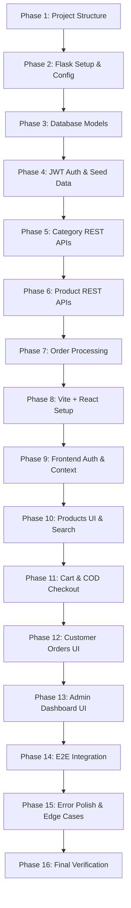

# Step-by-Step Implementation & Testing Plan

This document outlines the structured 16-phase development roadmap for the **Electronic Appliances Store** project. Each phase has specific deliverables, architectural checkpoints, and automated/manual verification gates.

---

## 📌 Phase Overview & Dependency Graph

---

## 🏗️ Phase-by-Phase Breakdown

### Phase 1: Project Structure & Environment Initialization
- **Tasks**:
  - Create directory layout: `client/` and `server/`.
  - Establish `.gitignore` for Python virtual environment (`venv/`), Python cache, SQLite database files (`*.db`), and Node modules (`node_modules/`, `dist/`).
  - Prepare configuration templates: `server/.env.example` and `client/.env.example`.
- **Verification Gate**:
  - Directory tree matches the exact specification without redundant folders.
  - Git tracking ignores sensitive `.env` and `store.db` files.

---

### Phase 2: Flask Backend Setup & Configuration
- **Tasks**:
  - Set up `server/requirements.txt` with exact versions:
    - `Flask`, `Flask-SQLAlchemy`, `Flask-JWT-Extended`, `Flask-Bcrypt`, `Flask-CORS`, `python-dotenv`.
  - Create `server/config.py` loading `JWT_SECRET_KEY`, `DATABASE_URL`, and debug settings.
  - Create `server/database.py` initializing `SQLAlchemy()`.
  - Create `server/app.py` with CORS enabled (`http://localhost:5173`) and basic health check endpoint `GET /api/health`.
- **Verification Gate**:
  - Run `python app.py` on Windows 11.
  - Verify `http://localhost:5000/api/health` returns `{ "status": "healthy" }`.

---

### Phase 3: Database Models & SQLite Integration
- **Tasks**:
  - Implement `server/models.py`:
    - `User`: `id`, `name`, `email`, `password`, `role`, `created_at`.
    - `Category`: `id`, `name`, `description`.
    - `Product`: `id`, `name`, `description`, `price`, `image`, `category_id`, `stock`, `created_at`.
    - `Order`: `id`, `user_id`, `products` (JSON text), `total_amount`, `shipping_name`, `phone`, `address`, `city`, `pincode`, `status`, `created_at`.
- **Verification Gate**:
  - Interactive Python shell executes `db.create_all()` without syntax or relational mapping errors.
  - Tables created in `server/store.db`.

---

### Phase 4: JWT Authentication & Admin Seeder
- **Tasks**:
  - Implement `server/routes/auth_routes.py`:
    - `POST /api/auth/register`: Validate email uniqueness, password confirmation, minimum length, and hash password with `bcrypt`.
    - `POST /api/auth/login`: Validate credentials and issue signed JWT containing user ID and role.
  - Implement `server/middleware/auth.py`:
    - `@jwt_required()` decorator.
    - `@admin_required` decorator checking `current_user.role == "admin"`.
  - Implement `server/seed.py`:
    - Checks for `admin@example.com` / `Admin@123`.
    - Seeds default admin if not present.
    - Seeds 5 appliance categories and 10 realistic products.
- **Verification Gate**:
  - Run `python seed.py` twice; confirm no duplicate admin created.
  - Test registration with valid and invalid inputs via curl / Postman.
  - Verify admin login yields valid token with `role: "admin"`.

---

### Phase 5: Category Management APIs
- **Tasks**:
  - Implement `server/routes/category_routes.py`:
    - `GET /api/categories`: Public list of all categories.
    - `POST /api/categories`: Admin-protected category creation.
    - `PUT /api/categories/:id`: Admin-protected category update.
    - `DELETE /api/categories/:id`: Admin-protected deletion with safety check preventing deletion if products exist.
- **Verification Gate**:
  - Test GET as guest (200 OK).
  - Attempt POST without token (401 Unauthorized).
  - Attempt POST with customer token (403 Forbidden).
  - Perform POST, PUT, DELETE with admin token (200/201 OK).

---

### Phase 6: Product Management, Search & Filter APIs
- **Tasks**:
  - Implement `server/routes/product_routes.py`:
    - `GET /api/products`: Public query with optional `?category=` filter and `?search=` term.
    - `GET /api/products/:id`: Public single item retrieval.
    - `POST /api/products`: Admin creation with price > 0, stock ≥ 0, valid category ID.
    - `PUT /api/products/:id`: Admin update.
    - `DELETE /api/products/:id`: Admin deletion.
- **Verification Gate**:
  - Test `/api/products?search=refrigerator` returns filtered results.
  - Test `/api/products?category=Televisions` returns only TVs.
  - Confirm stock and positive price validation on creation.

---

### Phase 7: Order Placement & Inventory Deduction
- **Tasks**:
  - Implement `server/routes/order_routes.py`:
    - `POST /api/orders`: Customer-only checkout.
      - **Zero-Trust Pricing**: Fetch authoritative price from DB.
      - Check stock availability for each item.
      - Atomically decrement product stock in DB.
      - Serialize order items snapshot into JSON string.
      - Default status: `Pending`.
    - `GET /api/orders/my-orders`: Returns orders where `user_id == current_user.id`.
    - `GET /api/admin/orders`: Admin-only list of all customer orders.
    - `PATCH /api/admin/orders/:id/status`: Admin status transition (`Pending` → `Confirmed` → `Shipped` → `Delivered` / `Cancelled`).
- **Verification Gate**:
  - Attempt order with manipulated price in request body; verify DB price is used instead.
  - Attempt order with quantity > stock; verify 400 Bad Request error.
  - Confirm product stock decreases in SQLite upon order creation.

---

### Phase 8: Frontend Initialization (Vite + React + Tailwind CSS)
- **Tasks**:
  - Initialize Vite React project in `client/`.
  - Install Tailwind CSS, PostCSS, Autoprefixer, `react-router-dom`, `axios`, `lucide-react`.
  - Configure `tailwind.config.js` and `client/src/index.css`.
  - Establish folder layout: `components/`, `pages/`, `services/`, `context/`.
- **Verification Gate**:
  - `npm run dev` boots cleanly at `http://localhost:5173`.
  - Tailwind utility classes render properly.

---

### Phase 9: Frontend Authentication & Context
- **Tasks**:
  - Create `client/src/services/api.js` with Axios interceptor attaching JWT token.
  - Create `client/src/services/authService.js`.
  - Create `client/src/context/AuthContext.jsx`:
    - Store `user`, `token`, `login()`, `logout()`, `isAuthenticated`, `isAdmin`.
    - Synchronize with `localStorage`.
  - Implement `ProtectedRoute.jsx`:
    - Handles redirect to `/login` for unauthenticated requests.
    - Handles redirect to `/` for unauthorized non-admin requests to admin routes.
  - Build `Login.jsx` and `Register.jsx` pages with validation and feedback alerts.
- **Verification Gate**:
  - Register new user; verify auto-redirection.
  - Login as customer vs. admin; verify role detection and token persistence.

---

### Phase 10: Product Catalog, Details, Search & Filter UI
- **Tasks**:
  - Create `Navbar.jsx`: Logo, links, cart badge count, login/register or user dropdown with logout.
  - Create `Footer.jsx`: Brand details and quick links.
  - Create `ProductCard.jsx`: Thumbnail, category badge, title, INR price, stock state ("In Stock" / "Out of Stock").
  - Create `Home.jsx`: Hero banner with "Shop Now" CTA, category highlight cards, featured appliances.
  - Create `Products.jsx`: Live search bar, category filter buttons, responsive 4-column product grid.
  - Create `ProductDetails.jsx`: Full-size image, description, quantity selector with stock boundary, Add-to-Cart button.
- **Verification Gate**:
  - Search appliance name in search box; results filter dynamically.
  - Category buttons filter product grid instantly.
  - Out of stock items display disabled "Out of Stock" button.

---

### Phase 11: Shopping Cart & Cash on Delivery Checkout UI
- **Tasks**:
  - Create `client/src/context/CartContext.jsx`:
    - `cartItems`, `addToCart(product, qty)`, `updateQuantity(id, qty)`, `removeFromCart(id)`, `clearCart()`.
    - Persist cart state in `localStorage`.
    - Enforce stock limit constraints.
  - Create `Cart.jsx`:
    - Itemized view with quantity increase/decrease buttons and remove button.
    - Subtotal and Grand Total display in INR (`₹`).
    - "Proceed to Checkout" button.
  - Create `Checkout.jsx`:
    - Order summary sidebar.
    - Shipping form (Name, Phone, Address, City, Pincode).
    - Payment Method card fixed to "Cash on Delivery".
    - "Place Order" button calling `POST /api/orders`.
- **Verification Gate**:
  - Add items to cart; refresh page; confirm cart state persists from `localStorage`.
  - Checkout with COD; verify cart clears automatically upon success and redirects to `/my-orders`.

---

### Phase 12: Customer "My Orders" UI
- **Tasks**:
  - Implement `client/src/pages/MyOrders.jsx`.
  - Fetch user's orders from `GET /api/orders/my-orders`.
  - Display order ID, placement date, status pill badge (color-coded), itemized list with images and unit prices, and delivery address.
  - Provide empty state when no orders exist.
- **Verification Gate**:
  - Placed orders show up immediately with status `Pending`.

---

### Phase 13: Admin Panel (Dashboard, Categories, Products, Orders)
- **Tasks**:
  - Build Admin Layout with responsive sidebar (Dashboard, Categories, Products, Orders, Logout).
  - Create `admin/Dashboard.jsx`: Metric cards for Total Categories, Total Products, and Total Orders.
  - Create `admin/Categories.jsx`: Add category form, categories table, edit modal, delete button with child-product safety check.
  - Create `admin/Products.jsx`: Add/Edit product modal (name, category dropdown, price, stock, image URL), product table with delete confirmation dialog.
  - Create `admin/Orders.jsx`: All customer orders table with status dropdown (`Pending` → `Confirmed` → `Shipped` → `Delivered` / `Cancelled`).
- **Verification Gate**:
  - Admin adds new product; verify it immediately appears in the customer storefront.
  - Admin changes order status from `Pending` to `Confirmed`; customer `/my-orders` reflects the change immediately.

---

### Phase 14: End-to-End Integration & Flow Testing
- **Tasks**:
  - Connect full stack on Windows 11:
    - Backend: `http://localhost:5000`
    - Frontend: `http://localhost:5173`
  - Execute full demo user flow:
    1. Admin adds Category & Product.
    2. Customer registers, browses, searches, filters, adds to cart, modifies qty.
    3. Customer checks out with COD.
    4. Backend decrements stock and stores order.
    5. Customer sees order in `/my-orders`.
    6. Admin updates status to `Confirmed` and `Shipped`.
- **Verification Gate**:
  - Zero console errors in browser dev tools.
  - Zero unhandled exceptions in Flask terminal.

---

### Phase 15: Error Handling, Edge Cases & Polish
- **Tasks**:
  - Implement friendly toast / alert notifications for all actions.
  - Ensure deletion modals require confirmation ("Are you sure you want to delete...?").
  - Test edge cases:
    - Attempting to purchase more than available stock.
    - Adding duplicate category name.
    - Registering with an existing email.
    - Accessing `/admin` as customer or unauthenticated guest.
    - Submitting empty checkout fields.
- **Verification Gate**:
  - All edge cases return clean user-facing error banners without crashing the application.

---

### Phase 16: Documentation & Final Verification
- **Tasks**:
  - Validate all `.md` files: `README.md`, `PROJECT_SPECIFICATION.md`, `ARCHITECTURE_AND_DATABASE.md`, `API_DOCUMENTATION.md`, and `IMPLEMENTATION_PLAN.md`.
  - Confirm Windows 11 commands, installation steps, and default credentials match implementation.
- **Verification Gate**:
  - Project documentation is complete, clear, self-contained, and ready for deployment/presentation.
